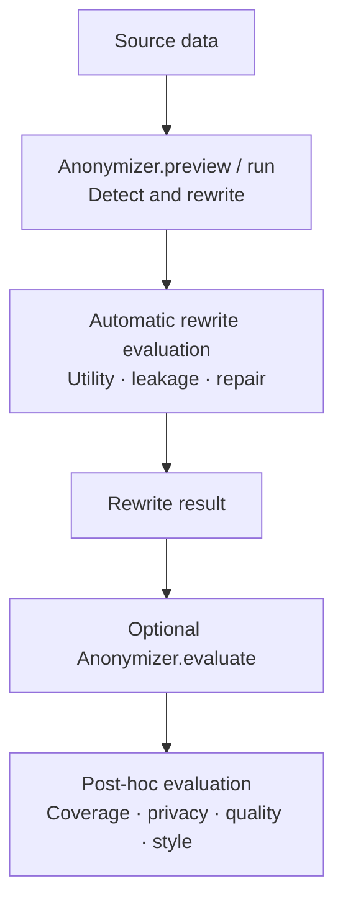
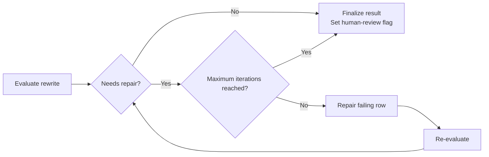

---
date:
  created: 2026-08-07
readtime: 10
authors:
  - memadi-nv
---

# **After Anonymization — Part II: Evaluating Rewrite Mode**

<!-- SPDX-FileCopyrightText: Copyright (c) 2025-2026 NVIDIA CORPORATION & AFFILIATES. All rights reserved. -->
<!-- SPDX-License-Identifier: Apache-2.0 -->

Replace mode can hide a name and change an address, yet leave the person recognizable. Imagine a biography describing the only pediatric cardiologist in a small desert city who trained overseas, survived a rare cancer, and later founded a clinic after a major wildfire. None of those details is a direct identifier. Together, they form a fingerprint that may point to one person.

Rewrite mode tackles that harder problem by transforming the entire record. But rewriting introduces a new risk: protect too little and identity clues remain; protect too much and the data loses its value.

NeMo Anonymizer evaluates that tradeoff twice. During anonymization, it measures how much identifying information remains (leakage) and how much useful meaning is preserved (utility), then repairs failing rewrites. Afterward, optional LLM judges assess literal entity coverage and the rewrite's overall privacy, quality, and style.

This is Part 2 of a two-part series on evaluation in Anonymizer. [Part 1](evaluation-anonymizer-replace.md) covers Replace mode, while this devnote covers Rewrite mode.

<!-- more -->

<div style="text-align: center;" markdown>

{ loading=lazy }

</div>

---

## Rewrite Evaluation Has Two Layers

Unlike Replace mode, automatic rewrite evaluation runs for every generated rewrite during `preview()` or `run()`. A separate `evaluate()` call adds independent LLM-as-judge feedback:



Automatic rewrite evaluation scores each generated text for privacy leakage and preserved meaning. If leakage triggers the configured repair criteria, Anonymizer rewrites the text and evaluates it again, stopping when it passes or reaches the maximum number of repair iterations. It then flags outputs for human review when residual leakage or low utility meets the configured review criteria. Post-hoc evaluation is an optional, separate step that you run by calling `evaluate()` after anonymization. It adds informational judge outputs without rewriting the text again or changing the existing human-review decision, and you can configure a different LLM for each judge role. See [Part 1](evaluation-anonymizer-replace.md#anonymization-and-evaluation-as-separate-steps) for more about this workflow.

```python
from anonymizer import Anonymizer, AnonymizerConfig, AnonymizerInput, EvaluateConfig, Rewrite

anonymizer = Anonymizer()

result = anonymizer.run(
    config=AnonymizerConfig(rewrite=Rewrite()),
    data=AnonymizerInput(source="records.csv", text_column="text"),
)

# Rewrite metrics are already present after run().
rewrite_metric_columns = [
    "utility_score",
    "leakage_mass",
    "weighted_leakage_rate",
    "needs_human_review",
]
rewrite_scores = result.dataframe[rewrite_metric_columns]

evaluated = anonymizer.evaluate(
    result,
    config=EvaluateConfig(compute_detection_validity=True),
)
posthoc_scores = evaluated.dataframe[
    ["entity_coverage", "detection_valid", "judge_evaluation"]
]
```

To evaluate in a later session instead, save the complete result:

```python
import pickle

with open("rewrite-result.pkl", "wb") as f:
    pickle.dump(result, f)

# In the later session:
with open("rewrite-result.pkl", "rb") as f:
    saved_result = pickle.load(f)

evaluated = anonymizer.evaluate(
    saved_result,
    config=EvaluateConfig(compute_detection_validity=True),
)
```

As in Replace mode, the completed result is reusable. Save the complete `AnonymizerResult` or `PreviewResult`—not just its `dataframe`—so the Rewrite configuration and evaluation context remain available.

---

## Automatic Rewrite Evaluation: Did the Rewrite Balance Privacy and Utility?

During `run()` or `preview()`, Anonymizer creates quality questions from the original record and privacy questions from the detected entities and the sensitivity and protection assigned to each one, called entity dispositions. It answers those questions against the rewritten text: quality answers determine utility, while privacy answers determine leakage and whether repair is needed. Low utility can flag a record for human review, but does not trigger repair.

### Utility Score: Was Important Meaning Preserved?

`utility_score` measures how well the rewritten text answers questions about the original record. Scores range from `0.0` to `1.0`; higher is better.

Before rewriting, Anonymizer extracts individual facts and relationships that the rewrite should preserve, called meaning units, and labels each one as `critical` or `important`. When computing `utility_score`, a critical meaning unit receives twice the weight of an important one:

```text
utility_score = weighted mean of per-question answer scores
```

A high score means the rewrite retained the important facts and relationships. It does not require verbatim wording or every identifying detail to survive.

### Leakage Mass: What Identifying Information Remains?

The privacy check tests whether each protected value—a sensitive value the rewrite should conceal—can still be identified or inferred. Every leaked item contributes a numeric sensitivity weight multiplied by the judge's confidence:

```text
leakage_mass = Σ(sensitivity_weight × leak_confidence)
```

High-, medium-, and low-sensitivity items carry weights of `1.0`, `0.6`, and `0.3`. Lower leakage mass is better, but it is not bounded at `1.0` because several items can leak in one record.

`weighted_leakage_rate` normalizes that mass by the maximum possible leakage for the record:

```text
weighted_leakage_rate = leakage_mass / maximum_possible_leakage_mass
```

It ranges from `0.0` to `1.0`. `any_high_leaked` separately records whether at least one high-sensitivity item leaked.

<div class="output-columns-table" markdown>

| Output column | Meaning |
|---|---|
| `utility_score` | Meaning preservation from `0.0` to `1.0`; higher is better |
| `leakage_mass` | Confidence-weighted sum of leaked items; lower is better |
| `weighted_leakage_rate` | Leakage normalized to the record's maximum possible mass |
| `any_high_leaked` | Whether any high-sensitivity item leaked |

</div>

### Automated Repair Loop: Can a Failing Rewrite Be Improved?

After the initial checks, rows above the repair threshold—or rows with a high-sensitivity leak when the selected risk tolerance requires it—enter the automated repair loop. Only failing rows are repaired and checked again. The loop stops when they pass or reach `max_repair_iterations`; at that limit, Anonymizer keeps the latest rewrite and calculates its final human-review flag.



For example, a rewrite might preserve that the person is a pediatric cardiologist who trained overseas and founded a clinic after a wildfire. That can score well on utility, but the distinctive combination may still produce high leakage. If it meets the repair criteria, Anonymizer rewrites and re-evaluates that row until it passes or reaches the iteration limit, then calculates the final human-review flag.

`risk_tolerance` controls the repair and review thresholds. The default is `low`; use `minimal` for a stricter posture or `moderate` / `high` for more tolerance. Setting `max_repair_iterations=0` disables repair but still computes the rewrite metrics.

### Human Review: Which Records Still Need Attention?

After repair ends, `needs_human_review` becomes `True` when the rewrite is missing, utility falls below the selected preset's threshold, or leakage mass exceeds its review threshold.

<div class="output-columns-table" markdown>

| Output column | Meaning |
|---|---|
| `needs_human_review` | Final review flag based on the rewrite metrics |

</div>

Records with no detected entities skip rewriting and pass through unchanged with `utility_score=1.0`, `leakage_mass=0.0`, and `needs_human_review=False`.

---

## Post-Hoc Evaluation: What Does an Independent Judge See?

The report includes entity coverage and a holistic rewrite judgment, with detection validity available as an opt-in audit.

### Entity Coverage: Were All In-Scope Entities Detected?

Entity coverage works the same way in Rewrite and Replace modes: an independent judge identifies literal sensitive values covered by the configured entity types and measures how many Anonymizer detected. It does not include latent entities—sensitive information implied rather than explicitly stated—or other clues that can only be inferred. See [Part 1: Entity Coverage](evaluation-anonymizer-replace.md#entity-coverage-were-all-in-scope-entities-detected) for the calculation, output columns, and interpretation guidance.

### Privacy: Did the Rewrite Reduce Linkage Risk?

The privacy rubric compares the rewritten record with the original and estimates whether a realistic attacker could link them. It considers surviving direct identifiers and details that may not identify someone alone but can do so when combined, called quasi-identifiers.

- `high` — direct identifiers are removed and remaining details create low linkage risk.
- `medium` — no obvious direct identifier remains, but a distinctive bundle creates noticeable risk.
- `low` — the record remains easily or near-certainly linkable.

### Quality: Was the Record's Meaning Preserved?

The quality rubric evaluates important facts, relationships, chronology, and conclusions independently from privacy and writing style.

- `high` — important meaning, facts, and structure are fully preserved.
- `medium` — most content is preserved with minor loss or distortion.
- `low` — important information is materially lost, contradicted, or distorted.

### Style: Does the Rewrite Read Naturally?

The style rubric evaluates fluency, grammar, clarity, coherence, and whether the result reads like human-written prose.

- `high` — fluent, coherent, and natural.
- `medium` — readable with isolated awkward phrasing.
- `low` — noticeably unnatural, broken, or placeholder-like.

All three rubric results are stored together in `judge_evaluation`. To retrieve the value for the first record:

```python
judge_evaluation = evaluated.dataframe.loc[0, "judge_evaluation"]
```

An example value looks like this:

```json
{
  "privacy": {"score": "high", "reasoning": "..."},
  "quality": {"score": "medium", "reasoning": "..."},
  "style": {"score": "high", "reasoning": "..."}
}
```

The `reasoning` field explains why the selected rubric level applies, using evidence from the original and rewritten text.

These rubric scores are informational. They do not trigger repair and do not modify `needs_human_review`.

### Detection Validity: Were the Detected Entities Valid in Context?

Detection validity uses the same opt-in judge as Replace mode to check whether detected `(value, label)` pairs are valid in context. Rewrite reports the fraction that passed from `0.0` to `1.0`, aligning it with Rewrite's numeric scoring, whereas Replace reports whether all detections passed as a boolean. See [Part 1: Detection Validity](evaluation-anonymizer-replace.md#detection-validity-were-the-detected-entities-valid-in-context) for what it flags and how to enable it.

---

## Reading the Report

To inspect the first record (row `0`):

```python
evaluated.display_record(0)
```

The Rewrite report shows the original and rewritten text, rewrite utility and leakage metrics, the human-review flag, judge privacy / quality / style scores, entity coverage, and the entity dispositions used to guide protection. When detection validity is enabled, that score and any flagged detections also appear.

<div style="text-align: center;" markdown>

{ loading=lazy }

</div>

For a tabular summary across records:

```python
evaluated.dataframe[[
    "utility_score",
    "leakage_mass",
    "weighted_leakage_rate",
    "needs_human_review",
    "entity_coverage",
    "detection_valid",
    "judge_evaluation",
]]
```

---

## Comparing Judge Models

Judge models are configured and compared the same way as in [Part 1: Comparing Judge Models](evaluation-anonymizer-replace.md#comparing-judge-models): run `evaluate()` on the same result with different model configurations, without rerunning anonymization. See [Evaluation: Model Roles](../../concepts/evaluation.md#model-roles) for the default model used by each evaluation step, which you can treat as the baseline when comparing candidate models.

---

## What the Scores Do Not Prove

The metrics and judges answer bounded questions. They do not certify that a rewrite is anonymous.

- **Utility score** measures preservation through generated questions; it can miss meaning that no question captured.
- **Leakage metrics** test known protected values and inferences; they do not model every possible attacker or external dataset.
- **Entity coverage** depends on one judge's candidate extraction and is not ground truth.
- **Detection validity** measures precision of detected entities, not whether all sensitive information was found.
- **Privacy, quality, and style** provide broad LLM-based assessments rather than definitive guarantees.

Use these signals together. Review representative records, inspect failures and entity dispositions, evaluate against annotated data when available, and apply human review where the risk requires it.

---

## The Bottom Line

Rewrite evaluation is not a single final score. Automatic rewrite evaluation measures utility and leakage, repairs rows that fail the privacy criteria, and flags residual leakage or low utility for human review. The optional post-hoc evaluation adds independent evidence about detection coverage and the rewrite's overall privacy, quality, and style.

The two layers serve different purposes: rewrite metrics guide repair during anonymization, while post-hoc evaluation provides a broader assessment of the completed results.

Skipping this optional evaluation can leave detection gaps and holistic privacy, quality, or style problems unnoticed until affected records reach downstream systems.

For API details and the complete output schema, see [Evaluation](../../concepts/evaluation.md). For Rewrite configuration and risk tolerance, see [Rewrite](../../concepts/rewrite.md).
